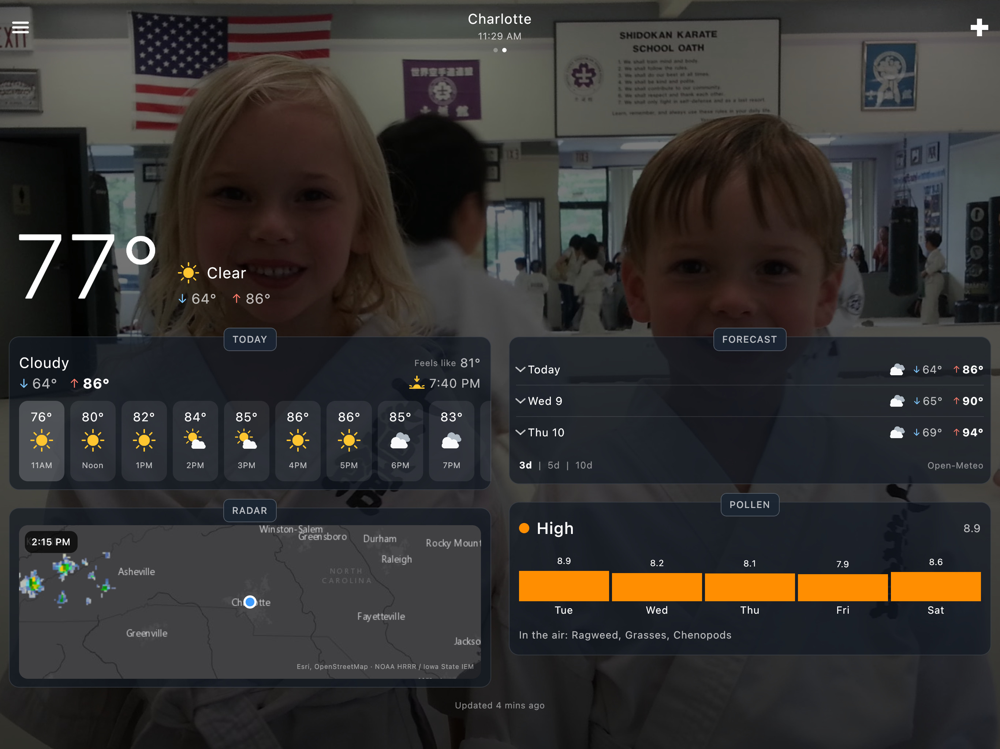
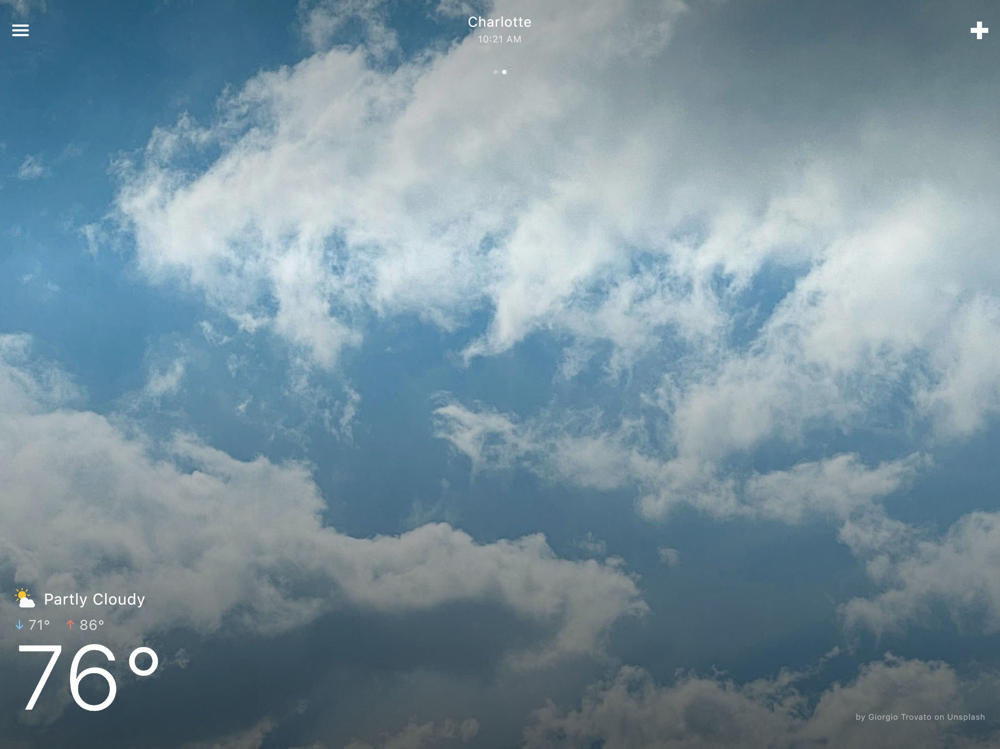
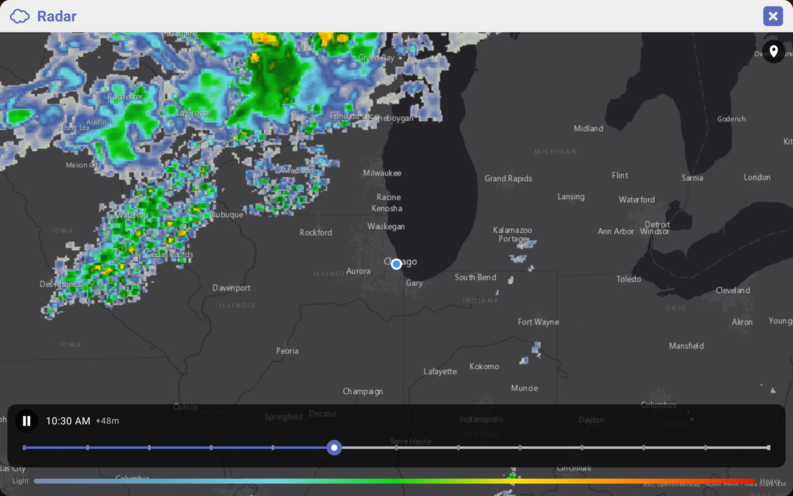
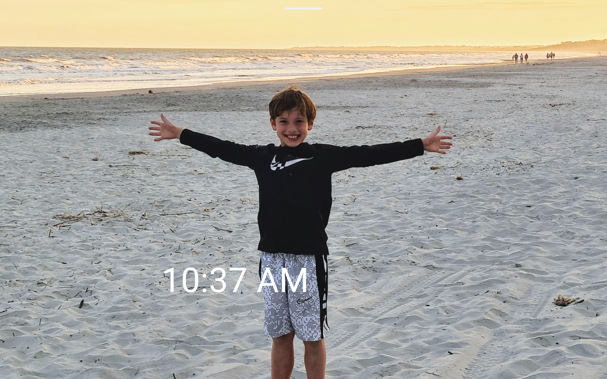
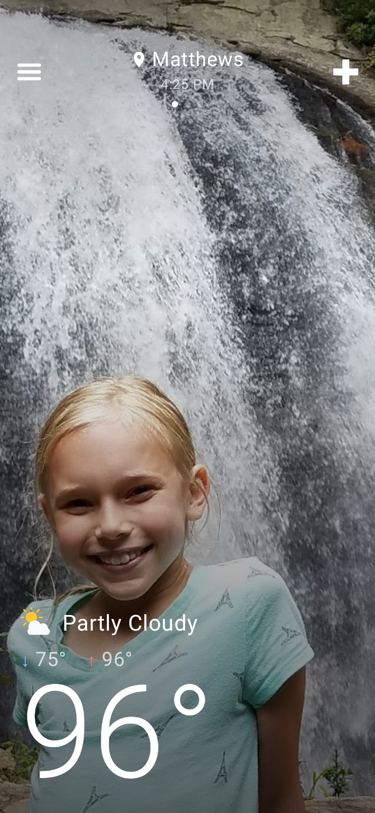
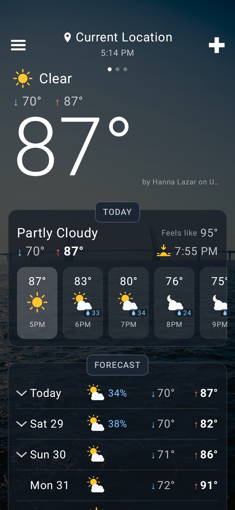
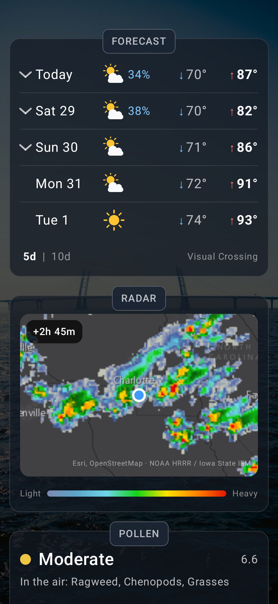
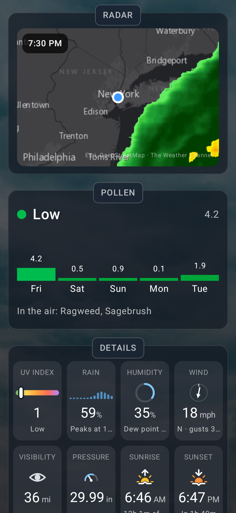

# Weather Dashboard+

**A full-screen weather app designed for wall mounted tablets**

<h1><a href="#install-section">Install</a></h1>
 

---

## Why you might like it

There's a million weather apps out there, but I wanted one that was **designed** for a wall-mounted tablet.

I had some requirements and a wish list:

- It has to be **full screen** - take full advantage of the screen with no system status bar
- It needs to keep the screen **on all day** and go **dark at night**
- It needs to be **simple to use** and **readable from a distance**
- And most importantly it needs to **look great** - this is a wall mounted tablet after all

---

## Basic Features

|                           |                                                                                                                |
|---------------------------|----------------------------------------------------------------------------------------------------------------|
| **Beautiful Backgrounds** | Displays beautiful, full-screen backgrounds that change based on the current weather conditions.               |
| **Large Current Temp**    | In collapsed view you just get the full screen background and a large temp. simple and looks great on the wall |
| **Hourly Forecast**       | A full day of hourly temperatures with chance of precipitation                                                 |
| **Daily Forecast**        | Up to 10 days on lows/highs and chance of precipitation                                                        |
| **Future Radar**          | Animated radar showing the next 3 hours of your current location                                               |
| **Full Screen Radar**     | View a full screen map you can pan and zoom, with play/pause and a slider to scrub through the next few hours  |
| **Pollen Forecast**       | The next 5 days pollen levels                                                                                  |
| **Weather Details**       | Additional details about the current weather                                                                   |
| **°F or °C**              | One switch in Settings; wind, pressure and visibility follow it                                                |
| **Refresh**               | Automatically on a schedule you pick (10 minutes by default), by pulling down, or by tapping the location name |

## Advanced Features

|                                 |                                                                                                                                                                                                                                                                                      |
|---------------------------------|--------------------------------------------------------------------------------------------------------------------------------------------------------------------------------------------------------------------------------------------------------------------------------------|
| **Multiple locations**          | Add current location or search by city; swipe between locations                                                                                                                                                                                                                      |
| **Full Screen**                 | Use the entire screen - no system status bars taking up space                                                                                                                                                                                                                        |
| **Keep Screen ON**              | Option to keep screen ON during the day (configurable) - essential for a wall mounted tablet                                                                                                                                                                                         |
| **Screensaver**                 | During the night you can enable a screen saver which will dim the screen and can be woken by tap or front camera motion. Or, just have the app let the screen turn off - and use a smart plug to turn it on again in the morning (see [this page](docs/public/ios-wake.md) for help) |
| **Multiple weather icon sets**  | Select from 4 sets of weather icons to find the one that you like the best                                                                                                                                                                                                           |
| **Configurable Weather Source** | Select from Open-Meteo weather source (default - no API key needed), Visual Crossing (API key), OpenWeatherMap (API key)                                                                                                                                                             |
| **Configurable Pollen Source**  | Select from pollen.com, Open-Meteo or Google Pollen (API key)                                                                                                                                                                                                                        |
| **Reorder Sections**            | Re-order the various weather sections to fit your needs                                                                                                                                                                                                                              |
| **Custom Photos**               | Use your own photos as backgrounds for the weather or as a screensaver                                                                                                                                                                                                               |

---

## Screenshots

|                                                                             |                                                                              |
|-----------------------------------------------------------------------------|------------------------------------------------------------------------------|
| **Main Screen**                                                             | **Forecast**                                                                 |
|  |  |
| **Radar**                                                                   | **Pollen**                                                                   |
|        |  |

|                                                                       |                                                                       |
|-----------------------------------------------------------------------|-----------------------------------------------------------------------|
|  |  |
|        |     |

---

## Install

<h2>iOS</h2>

- [App Store](https://apps.apple.com/us/app/weather-dashboard/id6806446844)
- For early access, you can also install the [TestFlight](https://testflight.apple.com/join/UXvEWcye) version

<h2>Android</h2>

- [Google Play](https://play.google.com/store/apps/details?id=com.jpage4500.weather)
- For early access, you can also install the [Beta version](https://play.google.com/apps/testing/com.jpage4500.weather)

<h2>Desktop (Mac/Windows/Linux)</h2>

- [GitHub release page](https://github.com/jpage4500/WeatherDashboardPlus/releases/latest)
    - NOTE: the desktop app auto-updates itself when a new version comes out

---

## About Me

I've been a developer for 20+ years. I am passionate about the products I work on and work to make them
the best in class any way that I can. AI has undoubtedly changed the programming landscape forever, and
I'm embracing it head-on. I know what I want in an app and AI allows me to get there 1000 times faster
than doing it myself. While that also means anyone can create an app from scratch today, I know what
features should look like, how to provide excellent support, and how to keep the code from getting
unmanageable. I will NEVER release any AI SLOP. Software can work differently for different people so
maintaining it is critical for making it last.

---

## Support

Found a bug, or want something added?

Send feedback from the app (**Settings ▸ About ▸ Support / Feedback**)

I try to be very responsive to support or bug requests — if it's something that's feasible and makes
sense to add, I'll do it.
