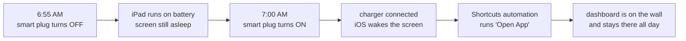

# Wake an iPad every morning

*Let the screen sleep overnight and have the dashboard back on the wall before you are.*

iOS gives an app no way to turn the screen on. An app can ask the system to *keep* the display awake
while it's in front — that's what Dashboard Mode does — but nothing in the sandbox can wake a display
that has already gone to sleep, and no amount of clever code changes that.

Hardware can. Plug an iPad into power and the screen lights up. So the whole trick is:

1. Put the iPad's charger on a **smart plug**.
2. Cut power for a few minutes every morning, then turn it back on.
3. Let a **Shortcuts automation** catch the moment power returns and open the dashboard.

Total setup time is about ten minutes, and none of it needs a Mac, a jailbreak or an MDM profile.

---

## How the morning goes

---

## What you'll need

| | |
| --- | --- |
| **A smart plug** | Anything you can put on a daily schedule — Apple Home / HomeKit, Home Assistant, Alexa, SmartLife, Kasa. It doesn't have to be HomeKit; nothing here talks to it from the iPad. |
| **The charging cable** | The iPad has to be powered *through* that plug. A battery-only mount won't work — there's no charger event to catch. |
| **No passcode** | *Settings → Face ID & Passcode → Turn Passcode Off.* With a passcode set the iPad wakes to the Lock Screen and the automation can't open anything until someone unlocks it. |
| **The Shortcuts app** | Built in. If it's been deleted, reinstall it free from the App Store. |

---

## 1. Decide what the night should look like

This is the step people skip, and then wonder why the smart plug never seems to do anything.

**Option A — the app runs the day (recommended).** In Weather Dashboard+, open
*Settings → Dashboard Mode* and pick **Day / Night**: the screen stays on between the hours you set
and sleeps outside them. Leave iOS **Auto-Lock** at whatever it is — while the app is holding the
screen on, Auto-Lock doesn't apply. When the window ends at night the iPad goes dark on its own, and
the smart plug is what brings it back in the morning.

**Worth knowing before you buy a plug:** *Outside Hours* has three settings, and only one of them
needs any of this.

| Outside Hours | What the iPad does at night | Needs a smart plug? |
| --- | --- | --- |
| **Screen Off** | Releases the display; iOS puts it to sleep | **Yes** — nothing can wake it in the morning |
| **Blank Screen** | Holds the display but paints it black at 1% brightness | No — the panel lights itself back up on schedule |
| **Screensaver** | Dimmed clock over your background | No — same, and it looks nicer in a hallway |

Blank Screen is the closest thing to "off" that still comes back by itself. Pick **Screen Off** only
if you want the display genuinely asleep — that's the case the smart plug solves.

**Option B — iOS keeps the screen on 24/7.** *Settings → Display & Brightness → Auto-Lock → Never.*
The display simply never sleeps. This works, but it makes the rest of this page pointless: nothing
ever needs waking. Only use it if you want the panel lit around the clock.

> The rest of this guide assumes **Option A with Screen Off at night** — that's the setup the smart
> plug exists for.

---

## 2. Schedule the smart plug

In your plug's own app (Apple Home, Home Assistant, SmartLife, Alexa — whichever it came with),
create one daily repeating rule:

| Time | Action |
| --- | --- |
| 6:55 AM | Turn the plug **off** |
| 7:00 AM | Turn the plug **on** |

Pick whatever wake time suits you; the five-minute gap is the part that matters. iOS needs to see a
real disconnect before it will register a fresh connect, and a gap that short costs the battery
almost nothing.

---

## 3. Build the Shortcuts automation

On the iPad itself — automations are per-device and don't sync from your phone:

1. Open **Shortcuts** and tap the **Automation** tab at the bottom.
2. Tap **+** in the top corner (or **Create Personal Automation** if this is the first one).
3. Scroll the trigger list and choose **Charger**.
4. Tick **Is Connected**, choose **Run Immediately** — *not* "Ask Before Running" — and tap **Next**.
5. Tap **New Blank Automation**, then **Add Action**.
6. Search for **Open App**, tap it, then tap the blue *App* placeholder and pick **Weather Dashboard+**.
7. Turn **Notify When Run** off so the launch is silent, and tap **Done**.

Test it without waiting for the morning: unplug the cable, count to ten, plug it back in. The screen
should light up and land on the dashboard.

📺 [How to Trigger a Charger Connected Automation](https://www.youtube.com/watch?v=7Sam4X6viCM) — the
same flow, on video, if you'd rather watch someone do it.

---

## 4. Lock the iPad to the app (optional)

If the panel is somewhere guests or kids can reach it, **Guided Access** pins the iPad to one app
until you triple-click your way out of it.

1. *Settings → Accessibility → Guided Access* → turn it **on**, and set a **Passcode Settings**
   passcode (this one is separate from the device passcode you removed — it's fine to have).
2. Open Weather Dashboard+ and triple-click the top button (or Home button) → **Start**.
3. Under **Session Settings** you can also disable **Motion** so the panel can't rotate.

One catch worth knowing: a Guided Access session does *not* survive a reboot. If the iPad ever
restarts — an update, a power blip long enough to drain it — you'll need to start the session again
by hand.

📺 [How to Set up Kiosk Mode on an iPad](https://www.youtube.com/watch?v=xmWunvURhbY)

---

## Troubleshooting

| Symptom | Usually means |
| --- | --- |
| Screen wakes, but shows the Lock Screen | The device passcode is still on. Turn it off. |
| Nothing happens when power returns | The automation is set to "Ask Before Running", or it got disabled. Open *Shortcuts → Automation*, tap it, and check. |
| It fires, but the wrong app opens | Another Charger automation is already there — you can only usefully have one. |
| Screen goes dark mid-morning | Dashboard Mode isn't set to Day / Night, or your screen-on window starts later than you think. |
| Works for a week, then stops | Check the plug schedule survived a firmware update, and that the cable still charges — a dead battery means no automation at all. |

**On battery health:** an iPad parked at 100% on a charger all day is not ideal, but it's what every
wall-mounted panel does, and iOS's own Optimized Battery Charging helps. The five-minute daily
outage is far too short to matter either way.

---

## Further reading

Apple's own documentation, all with screenshots:

- [Create a new personal automation in Shortcuts](https://support.apple.com/guide/shortcuts/create-a-new-personal-automation-apdfbdbd7123/ios)
- [Setting triggers in Shortcuts](https://support.apple.com/guide/shortcuts/setting-triggers-apde31e9638b/ios) — what the Charger trigger actually fires on
- [Enable or disable a personal automation](https://support.apple.com/guide/shortcuts/enable-or-disable-a-personal-automation-apd602971e63/ios)
- [Set a passcode on iPad](https://support.apple.com/guide/ipad/set-a-passcode-ipad997daf9f/ipados) — and how to turn one off
- [Keep the iPad display on longer](https://support.apple.com/guide/ipad/keep-the-ipad-display-on-longer-ipad11dbabaf/ipados) — the Auto-Lock setting
- [Lock iPad to one app with Guided Access](https://support.apple.com/guide/ipad/lock-ipad-to-one-app-ipada16d1374/ipados)
- [Wake, unlock, and lock iPad](https://support.apple.com/guide/ipad/wake-unlock-and-lock-ipad9940ee8d/ipados)

And from people running the same setup:

- [Wall-mount tablet charger smart plug automation](https://community.home-assistant.io/t/wallmount-tablet-charger-smart-plug-automation-or-template/292370) — Home Assistant community thread
- [iPad Wall Mount — 1 Year Later: tips, tricks, best practices](https://www.youtube.com/watch?v=NMZIgCG6nVE)
